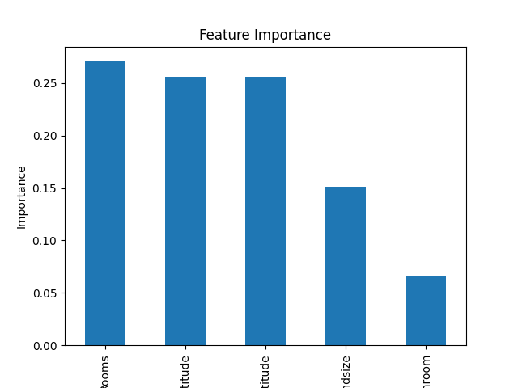

````markdown
# Melbourne Housing Price Predictor

This project predicts housing prices in Melbourne using the **Melbourne Housing Dataset**.  
It demonstrates how to use **Decision Tree Regression** for real estate price prediction and evaluates model performance using standard regression metrics.

---

## Dataset
- Source: [Melbourne Housing Dataset on Kaggle](https://www.kaggle.com/datasets/dansbecker/melbourne-housing-snapshot)  
- Contains information about properties in Melbourne including:  
  - `Rooms`, `Bathroom`, `Landsize`, `Lattitude`, `Longtitude`  
  - Price (`Price`) — target variable  
- Dataset has been cleaned by dropping rows with missing values.

---

## Features Used
| Feature       | Description                           |
|---------------|---------------------------------------|
| Rooms         | Number of rooms in the property       |
| Bathroom      | Number of bathrooms                   |
| Landsize      | Land size in square meters            |
| Lattitude     | Latitude of the property              |
| Longtitude    | Longitude of the property             |

> Only numerical features were used for this simple model.

---

## Model
- **Decision Tree Regressor** (`sklearn.tree.DecisionTreeRegressor`)  
- Random state set for reproducibility (`random_state=1`)  

---

## Instructions to Run
1. Clone the repository:

```bash
git clone <repo_url>
cd melbourne-housing-predictor
````

2. Install dependencies:

```bash
pip install -r requirements.txt
```

3. Run the script:

```bash
python melbourne_model.py
```

4. The script will:

   * Load and clean the dataset
   * Split data into training and test sets
   * Train a Decision Tree Regressor
   * Make predictions on the test set
   * Display evaluation metrics (`MAE` and `R² Score`)
   * Print predictions for a few test samples

---

## Evaluation Metrics

| Metric              | Value     |
| ------------------- | --------- |
| Mean Absolute Error | \~253,784 |
| R² Score            | \~0.58    |
| Accuracy (%)        | \~58%     |

> The model achieves moderate performance due to limited features and complexity of housing prices.

---

## Visualizations



---

## Observations & Limitations

* The model performs moderately with R² \~0.58 using only 5 features.
* Adding more relevant features (e.g., `Type`, `YearBuilt`, `Postcode`) would improve accuracy.
* Decision Trees can overfit on training data; ensemble methods like Random Forest or Gradient Boosting are recommended for better performance.
* Large MAE is partly due to high variance in Melbourne housing prices.

---

## Dependencies

* pandas
* numpy
* scikit-learn
* matplotlib

Install all dependencies using:

```bash
pip install pandas numpy scikit-learn matplotlib
```

